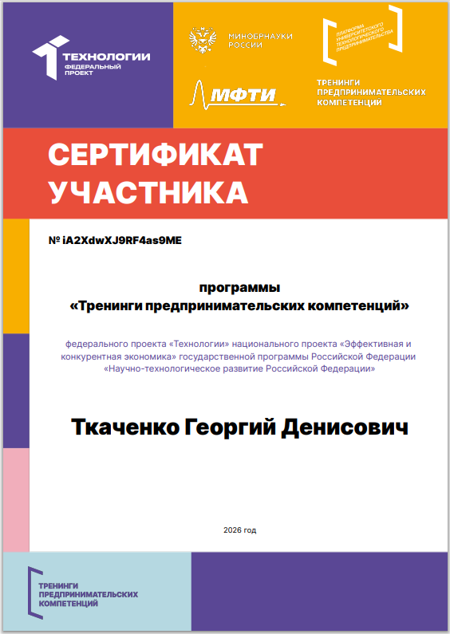
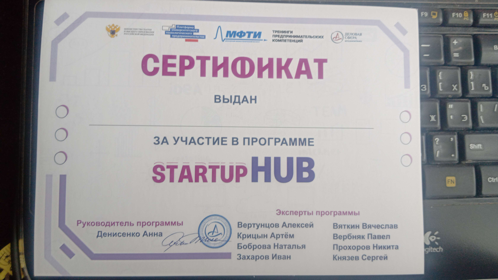

# Отчёт о мероприятии

## Название мероприятия
Тренинг STARTUP HUB

## Организатор
МФТИ совместно с Московским Политехом

## Дата и формат
Проводилась 15.05.2026 в очном формате

### Тренинги по созданию качественного проекта и развитию предпринимательских навыков 
- Генерация и формирование идей продукта
- Формирование команды технологического стартапа
- Разработка гипотез, MVP и модели
- Создание структуры бизнес-проекта и разработка бизнес-модель стартапа
- Тренерова в презентации и переговорах с инвестором (остольными участниами тренинга)
- Получены 2 сертификаты о прохождении тренинга

## Полученные навыки и знания

- Научился генерировать и проверять бизнес-гипотезы
- Получил опыт командной работы над проектом
- Получил знания по соданию нужных для проета документов и навыки презентации

## Сертификат

По итогам тренинга получен сертификаты о прохождении программы (они находятся в этой папке под именами:  и )

## Связь с проектом

Навыки презентации и структурирования идей пригодились при оформлении отчёта по практике и защите проекта.